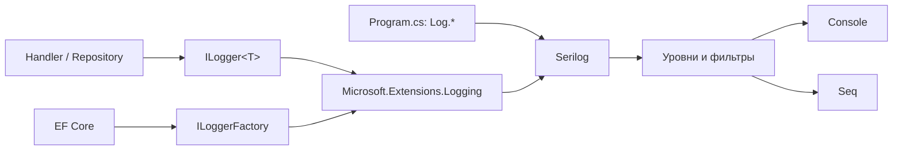
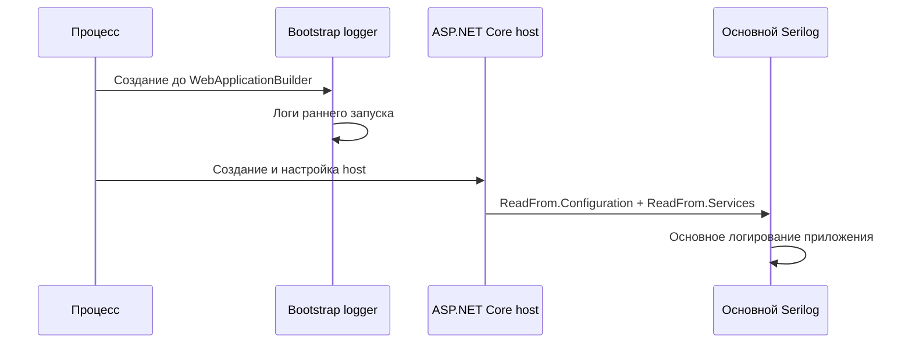
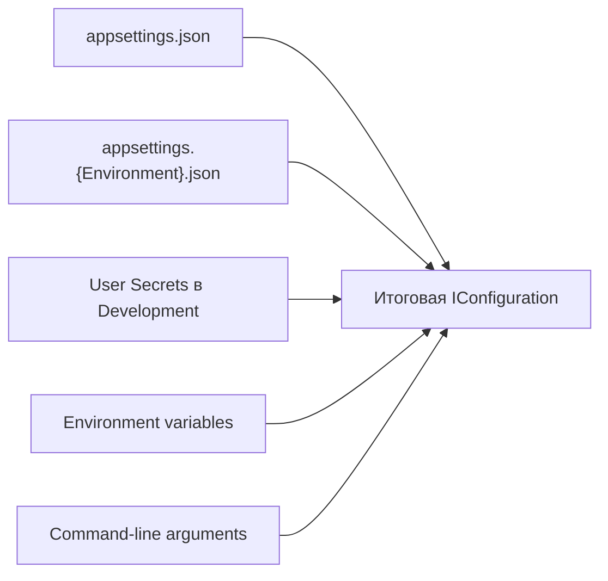
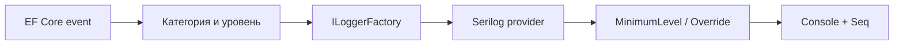
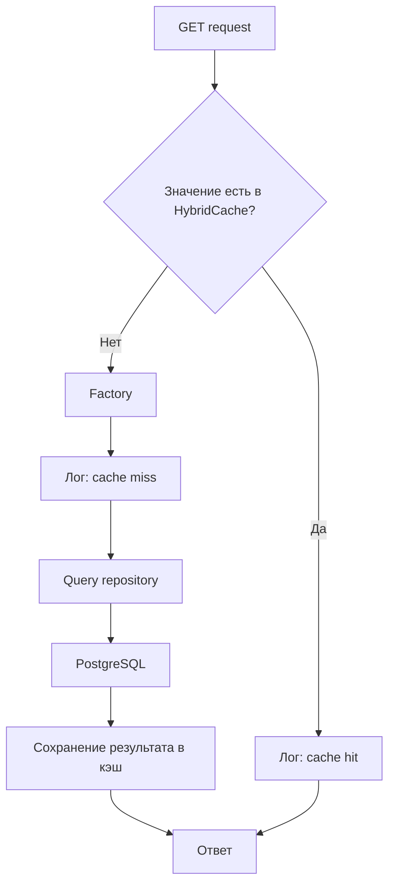

# Логирование в Directory Service

## Общая схема

В приложении используется стандартная абстракция `Microsoft.Extensions.Logging`, а Serilog выступает ее провайдером и отвечает за фильтрацию, обогащение и отправку событий в sinks.



Основные файлы конфигурации:

- `src/DirectoryService.Presentation/Program.cs` - создание bootstrap-логгера, подключение Serilog и HTTP request logging;
- `src/DirectoryService.Presentation/appsettings.json` - основная конфигурация Serilog;
- `src/DirectoryService.Presentation/appsettings.Development.json` - переопределения для Development;
- `src/DirectoryService.Infrastructure/Extensions/DependencyInjectionExtensions.cs` - подключение EF Core к `ILoggerFactory`.

## Два этапа настройки Serilog

### 1. Bootstrap logger

В начале `Program.cs` создается временный логгер:

```csharp
Log.Logger = new LoggerConfiguration()
    .MinimumLevel.Override("Microsoft", LogEventLevel.Warning)
    .Enrich.FromLogContext()
    .WriteTo.Console(theme: AnsiConsoleTheme.Sixteen)
    .CreateBootstrapLogger();
```

Он работает до построения ASP.NET Core host и позволяет увидеть ошибки при:

- чтении конфигурации;
- регистрации зависимостей;
- построении приложения;
- запуске миграций;
- старте приложения.

Настройки bootstrap-логгера не являются окончательной конфигурацией приложения.

### 2. Основной logger

После создания `WebApplicationBuilder` Serilog подключается к host:

```csharp
builder.Host.UseSerilog((context, services, loggerConfiguration) =>
{
    loggerConfiguration
        .ReadFrom.Configuration(context.Configuration)
        .ReadFrom.Services(services)
        .Enrich.FromLogContext();
});
```



- `ReadFrom.Configuration` читает секцию `Serilog` из итоговой конфигурации приложения.
- `ReadFrom.Services` подключает зарегистрированные через DI enrichers, sinks и другие компоненты Serilog.
- `FromLogContext` добавляет свойства из текущего логического контекста.

## Конфигурация в appsettings

Основные элементы секции `Serilog`:

```json
{
  "Serilog": {
    "MinimumLevel": {
      "Default": "Information",
      "Override": {
        "Microsoft": "Warning",
        "Microsoft.AspNetCore": "Warning",
        "Microsoft.EntityFrameworkCore": "Warning"
      }
    },
    "Enrich": ["FromLogContext"],
    "WriteTo": [
      {
        "Name": "Console",
        "Args": {
          "outputTemplate": "[{Timestamp:HH:mm:ss} {Level:u3}] {Message:lj}{NewLine}{Exception}"
        }
      }
    ],
    "Properties": {
      "Application": "DirectoryService"
    }
  }
}
```

### MinimumLevel

`Default` применяется ко всем событиям, для которых нет более специфичного override.

`Override` задает порог для категории и всех ее вложенных категорий:

```text
Microsoft
└── Microsoft.EntityFrameworkCore
    └── Microsoft.EntityFrameworkCore.Database.Command
```

Чем категория специфичнее, тем выше приоритет ее настройки.

### Объединение appsettings

ASP.NET Core последовательно объединяет конфигурацию:



Источники, подключенные позже, переопределяют совпадающие ключи, но не удаляют остальные ключи объекта.

В текущем `appsettings.Development.json` указано:

```json
{
  "Serilog": {
    "MinimumLevel": {
      "Default": "Debug",
      "Override": {
        "Microsoft": "Information",
        "Microsoft.AspNetCore": "Information"
      }
    }
  }
}
```

Однако базовый ключ `Microsoft.EntityFrameworkCore: Warning` остается. Поэтому итоговые уровни выглядят так:

| Категория | Production | Development |
|---|---:|---:|
| Код приложения | `Information` | `Debug` |
| `Microsoft.*` | `Warning` | `Information` |
| `Microsoft.AspNetCore.*` | `Warning` | `Information` |
| `Microsoft.EntityFrameworkCore.*` | `Warning` | `Warning` |

## Уровни логирования

| `ILogger` | Serilog | Назначение |
|---|---|---|
| `Trace` | `Verbose` | Максимально подробная диагностика |
| `Debug` | `Debug` | Отладочная информация для разработчика |
| `Information` | `Information` | Нормальные важные события приложения |
| `Warning` | `Warning` | Неожиданная ситуация без остановки операции |
| `Error` | `Error` | Операция завершилась ошибкой |
| `Critical` | `Fatal` | Приложение или важная подсистема не может продолжать работу |

Порог включает выбранный уровень и все уровни выше. Например, `Warning` пропускает `Warning`, `Error` и `Critical`, но отбрасывает `Information`, `Debug` и `Trace`.

## ILogger и статический Log

### ILogger<T>

В handler, repository и других сервисах следует использовать `ILogger<T>`:

```csharp
public sealed class LocationQueryRepository
{
    private readonly ILogger<LocationQueryRepository> _logger;

    public LocationQueryRepository(ILogger<LocationQueryRepository> logger)
    {
        _logger = logger;
    }
}
```

```csharp
_logger.LogInformation(
    "Locations loaded from database. ItemCount: {ItemCount}",
    locations.Count);
```

Преимущества:

- код зависит от стандартной абстракции .NET, а не напрямую от Serilog;
- автоматически добавляется категория класса (`SourceContext`);
- зависимость удобно заменять в тестах;
- реализацию логирования можно заменить без изменения application-кода.

### Log.*

`Log.Information`, `Log.Error` и `Log.Fatal` - прямые вызовы статического API Serilog:

```csharp
Log.Information("Starting DirectoryService");
```

Их разумно использовать в `Program.cs`, когда DI еще не построен. В handler и repository предпочтительнее `ILogger<T>`.

## Структурное логирование

Значения нужно передавать отдельными параметрами, а не собирать строку интерполяцией:

```csharp
// Правильно: ItemCount станет отдельным полем события в Seq.
_logger.LogInformation(
    "Locations loaded. ItemCount: {ItemCount}",
    locations.Count);

// Нежелательно: значение останется частью обычного текста.
_logger.LogInformation($"Locations loaded. ItemCount: {locations.Count}");
```

В Seq по структурированному свойству можно фильтровать:

```text
Application = 'DirectoryService' and ItemCount > 20
```

Для объектов и коллекций используется destructuring:

```csharp
_logger.LogError(
    exception,
    "Cache invalidation failed. Tags: {@CacheTags}",
    tags);
```

## Логирование EF Core

EF Core пишет события через `Microsoft.Extensions.Logging` и категории `Microsoft.EntityFrameworkCore.*`.

В проекте `DbContext` получает общий `ILoggerFactory`:

```csharp
var loggerFactory = serviceProvider.GetRequiredService<ILoggerFactory>();
options.UseLoggerFactory(loggerFactory);
```

После `UseSerilog()` этот `ILoggerFactory` направляет события EF Core в Serilog, а затем в Console и Seq.



Примеры категорий:

- `Microsoft.EntityFrameworkCore.Database.Command` - выполнение SQL-команд;
- `Microsoft.EntityFrameworkCore.Database.Connection` - соединения с БД;
- `Microsoft.EntityFrameworkCore.Database.Transaction` - транзакции;
- `Microsoft.EntityFrameworkCore.Query` - построение и компиляция запросов;
- `Microsoft.EntityFrameworkCore.Update` - сохранение изменений.

Обычная успешно выполненная SQL-команда чаще всего имеет уровень `Information`. Ошибки выполнения имеют уровень `Error`. Внутренняя диагностика EF Core часто использует `Debug`.

Чтобы в Development видеть SQL, но не включать все подробные события EF Core:

```json
{
  "Serilog": {
    "MinimumLevel": {
      "Override": {
        "Microsoft.EntityFrameworkCore": "Warning",
        "Microsoft.EntityFrameworkCore.Database.Command": "Information"
      }
    }
  }
}
```

`EnableSensitiveDataLogging()` разрешает включать в события значения параметров и ключей сущностей. Он не меняет уровень событий и должен использоваться только в Development.

`EnableDetailedErrors()` добавляет больше контекста в исключения EF Core, но также не управляет минимальным уровнем логирования.

> Dapper сам по себе не отправляет выполняемый SQL в `ILogger`. Для Dapper-запросов в проекте используются собственные структурированные логи query repository.

## HTTP request logging

`UseSerilogRequestLogging()` создает одно итоговое событие на HTTP-запрос:

```text
HTTP GET /api/locations responded 200 in 12.3456 ms
```

В текущей конфигурации уровень определяется статусом ответа:

| Условие | Уровень |
|---|---|
| Успешный ответ | `Information` |
| HTTP 4xx | `Warning` |
| HTTP 5xx или exception | `Error` |

К событию дополнительно добавляются:

- `TraceId`;
- `RemoteIpAddress`;
- `UserAgent`;
- `RequestMethod`;
- `RequestPath`;
- `StatusCode`;
- `Elapsed`.

`TraceId` позволяет найти в Seq все события, относящиеся к одному запросу.

## Console и Seq

Console sink настраивается в секции `Serilog:WriteTo`. Seq sink добавляется программно, если указан `Seq:ServerUrl`:

```csharp
var seqServerUrl = context.Configuration["Seq:ServerUrl"];

if (!string.IsNullOrWhiteSpace(seqServerUrl))
    loggerConfiguration.WriteTo.Seq(seqServerUrl);
```

Адрес зависит от места запуска API:

| Где запущен API | Адрес Seq |
|---|---|
| Локально на машине | `http://localhost:5343` |
| В Docker Compose | `http://seq:5341` |

В Docker значение передается переменной окружения:

```yaml
Seq__ServerUrl: http://seq:5341
```

Двойное подчеркивание соответствует разделителю конфигурации `:`: `Seq__ServerUrl` превращается в `Seq:ServerUrl`.

## Cache hit и обращение к БД

`HybridCache.GetOrCreateAsync` выполняет factory только при отсутствии актуального значения в кэше:



Repository не может сообщить о cache hit, потому что при cache hit он вообще не вызывается. Поэтому:

- handler логирует `cache hit` или `cache miss`;
- query repository логирует фактическое обращение к PostgreSQL и количество полученных записей.

## Рекомендуемые правила

1. Использовать `ILogger<T>` во всех сервисах, handler и repository.
2. Оставлять статический `Log.*` преимущественно для запуска и остановки приложения в `Program.cs`.
3. Использовать шаблоны сообщений и структурированные свойства вместо интерполяции строк.
4. Логировать идентификаторы, количество записей, длительность и результат операции.
5. Не логировать пароли, connection strings, токены и персональные данные.
6. Не писать успешное событие одновременно на нескольких уровнях без необходимости.
7. Для ожидаемых ошибок использовать `Warning`, для сбоев операции - `Error`.
8. Исключение передавать первым аргументом в `LogError`.
9. Подробные EF Core SQL-логи и sensitive data включать только в Development.
10. Использовать `TraceId`, `CacheKey`, entity id и другие свойства для фильтрации событий в Seq.

## Быстрая диагностика

Если лог не появился, проверить по порядку:

1. Достиг ли код вызова `ILogger`.
2. Не ниже ли уровень события настроенного минимального уровня.
3. Нет ли более специфичного `MinimumLevel.Override`.
4. Загружен ли правильный `appsettings.{Environment}.json`.
5. Не переопределена ли настройка environment variable или user secrets.
6. Доступен ли sink: Console или Seq.
7. Для EF Core - разрешена ли нужная категория, например `Microsoft.EntityFrameworkCore.Database.Command`.
8. Для Dapper - добавлен ли собственный лог вокруг запроса.
